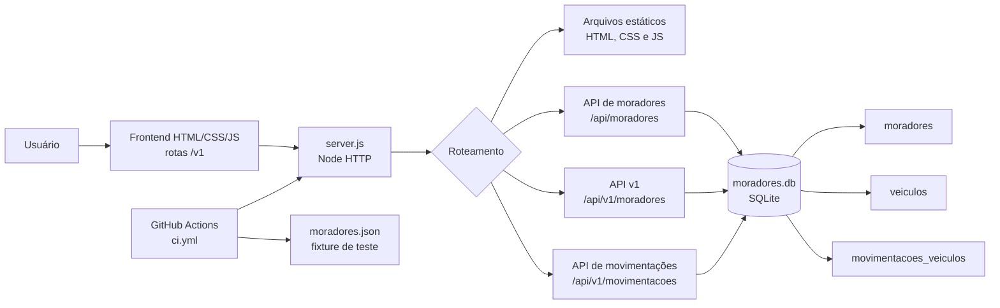

# Spazio

Aplicação web de portaria para consulta e gerenciamento de moradores, veículos e movimentações de entrada e saída. O projeto usa somente recursos nativos do Node.js no backend e HTML, CSS e JavaScript no frontend.

## Requisitos

- Node.js `>= 22.13.0` (necessário para o módulo nativo `node:sqlite` usado pelo servidor)
- Git, caso o projeto seja obtido por clonagem

Não há dependências externas para instalar: o `package.json` contém apenas o script de inicialização.

## Rodando localmente

### 1. Obter o projeto

```bash
git clone https://github.com/fernandomagno/spazio.git
cd spazio
```

Se o repositório já estiver disponível localmente, basta entrar na pasta do projeto.

### 2. Conferir a versão do Node.js

```bash
node --version
```

A versão precisa ser `22.13.0` ou superior.

### 3. Iniciar o servidor

```bash
npm start
```

Por padrão, a aplicação ficará disponível em <http://localhost:3000>. O arquivo `moradores.db` será criado automaticamente na raiz na primeira execução e está ignorado pelo Git.

Para usar outra porta:

```bash
PORT=8080 npm start
```

No Windows PowerShell:

```powershell
$env:PORT=8080; npm start
```

### 4. Acessar a interface

Abra <http://localhost:3000/v1/> no navegador. As telas disponíveis são:

- **Busca**: pesquisa moradores por nome, placa ou apartamento.
- **Cadastro**: cria moradores e associa carros ou motos.
- **Edição**: atualiza dados e veículos de moradores ativos.
- **Detalhes**: lista os dados dos moradores ativos.
- **Inativação**: marca moradores como inativos sem apagar o histórico.
- **Movimentação**: registra entrada e saída de carros ativos.
- **Relatório**: exibe a situação cadastral das unidades.

Para parar o servidor, use `Ctrl+C` no terminal.

## Estrutura do projeto

```text
spazio/
├── server.js                    # Servidor HTTP, rotas, validações e SQLite
├── package.json                 # Metadados e comando npm start
├── moradores.json               # Fixture anonimizada usada pela validação da CI
├── .gitignore                   # Ignora o banco SQLite local
├── .github/
│   └── workflows/
│       └── ci.yml               # Validação de sintaxe e smoke test
├── index.html                   # Tela de busca (servida em /v1/)
├── script.js                    # Lógica da busca
├── cadastro-moradores.html      # Tela de cadastro
├── cadastro.js                  # Lógica do cadastro
├── editar-moradores.html        # Tela de edição
├── edicao.js                    # Lógica da edição
├── detalhes-moradores.html      # Tabela de detalhes
├── inativar-moradores.html      # Tela de inativação
├── inativacao.js                # Lógica de inativação
├── movimentacao-veiculos.html   # Tela de movimentações
├── movimentacao-veiculos.js     # Lógica de movimentações
├── atualizacao-cadastro.html     # Relatório cadastral
├── atualizacao-cadastro.js      # Lógica do relatório
├── morador.html                 # Detalhes de um apartamento
├── morador.js                   # Lógica dos detalhes do apartamento
└── style.css                    # Estilos compartilhados
```

Os arquivos HTML, JavaScript e CSS ficam na raiz por compatibilidade com a estrutura atual. O servidor os publica com a versão virtual `/v1`; não existe uma pasta física `v1/`.

## Arquitetura



### Persistência

O banco é criado e atualizado pelo `server.js` usando SQLite:

- `moradores`: dados cadastrais e status ativo/inativo.
- `veiculos`: veículos vinculados aos moradores.
- `movimentacoes_veiculos`: histórico das entradas e saídas.

O banco local não deve ser versionado. Para começar com uma base vazia, pare o servidor e remova `moradores.db` e os arquivos auxiliares `moradores.db-*`.

## Rotas principais

### Interface

| URL | Função |
| --- | --- |
| `/v1/` | Busca |
| `/v1/cadastro-moradores.html` | Cadastro |
| `/v1/editar-moradores.html` | Edição |
| `/v1/detalhes-moradores.html` | Detalhes |
| `/v1/inativar-moradores.html` | Inativação |
| `/v1/movimentacao-veiculos.html` | Movimentação |
| `/v1/atualizacao-cadastro.html` | Relatório |
| `/v1/morador/{apto}` | Detalhes do apartamento |

As URLs antigas `/` e `/morador/{apto}` redirecionam para `/v1`.

### API

| Método | Endpoint | Uso |
| --- | --- | --- |
| `GET` | `/api/moradores` | Lista todos os moradores |
| `POST` | `/api/moradores` | Cadastra um morador |
| `PUT` | `/api/moradores/{id}` | Atualiza um morador |
| `GET` | `/api/v1/moradores` | Lista moradores ativos |
| `PATCH` | `/api/v1/moradores/{id}` | Inativa um morador |
| `GET` | `/api/v1/movimentacoes` | Lista carros e movimentações |
| `POST` | `/api/v1/movimentacoes` | Registra entrada ou saída |

## Validação e CI

Para executar localmente a mesma verificação básica de sintaxe dos arquivos JavaScript:

```bash
for file in *.js; do node --check "$file"; done
```

O workflow em `.github/workflows/ci.yml` executa a validação de sintaxe e um smoke test que inicia o servidor, cadastra a fixture `moradores.json`, testa a inativação e verifica as rotas principais.

## Observações

- Não execute o servidor em uma pasta compartilhada com dados reais sem avaliar autenticação, autorização e proteção dos dados.
- O banco local contém dados persistentes; faça backup antes de removê-lo.
- O servidor aceita `PORT` por variável de ambiente e usa `3000` quando ela não está definida.
